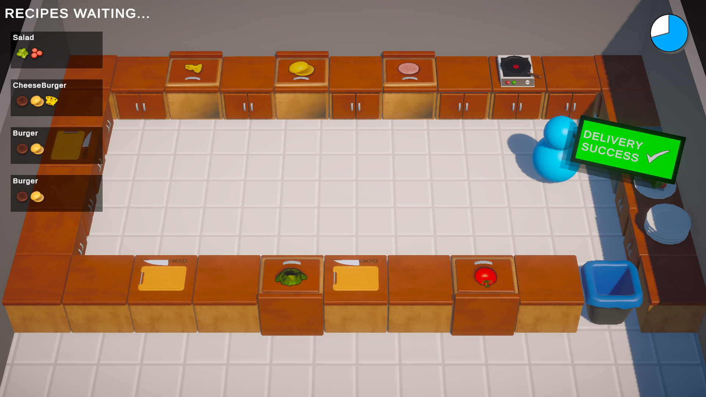

# Kitchen Chaos (Enhanced)

This project is an enhanced version of the "Kitchen Chaos" game, initially developed by Code Monkey, following their comprehensive Unity game development tutorial. While the core mechanics are built upon the tutorial, this version features custom additions and improvements to offer a more complete gaming experience.

---

## About the Game

"Kitchen Chaos (Enhanced)" is a cooking game where players work to prepare and serve dishes to customers. The goal is to efficiently manage ingredients, cook meals, and deliver them before time runs out! This version expands on the tutorial's foundation with unique level designs and additional gameplay elements.

---

## Features

- **Original Core Mechanics:**
  - Ingredient picking and placing.
  - Cooking, chopping, and burning mechanics.
  - Order management and serving system.
- **Custom Enhancements (This Version):**
  - **Multiple Levels:** Enjoy three distinct levels, each with unique layouts.
  - **Improved UI elements**

---

## How to Play

Players control chefs in a chaotic kitchen environment.

1.  Gather necessary ingredients from storage areas.
2.  Process ingredients (chop, cook) on designated counters.
3.  Combine ingredients to form the ordered dish.
4.  Deliver the finished dish to the serving counter.
5.  Avoid burning food and manage your time effectively!

---

## Screenshots


_Overview of the main menu._


_Overlay of the level select screen._


_Image of the tutorial._


_A chaotic moment in Level 1!_


_Exploring the unique layout of Level 2._


_Different ambiance of level 3._

---

## Installation / Running the Game

### Download & Play (Windows)

1.  Go to the [Releases](https://github.com/Makelfy/Overcooked/releases) section of this GitHub repository.
2.  Download the latest `.zip` file (e.g., `KitchenChaos_v1.0.zip`).
3.  Extract the contents of the `.zip` file to a folder on your computer.
4.  Run the `KitchenChaos.exe` executable to start the game.

### Building from Source

1.  Clone this repository to your local machine:
    ```bash
    git clone [https://github.com/Makelfy/Overcooked.git](https://github.com/Makelfy/Overcooked.git)
    ```
2.  Open the project in Unity (using a compatible Unity Editor version, e.g., Unity 2022.3.x LTS).
3.  Navigate to `File > Build Settings`.
4.  Ensure all desired scenes are added to "Scenes In Build".
5.  Click "Build" and choose a destination folder to create the executable.

---

## Credits

This project is an extension of the excellent "Kitchen Chaos" tutorial series by Code Monkey.

- **Tutorial Link:** [https://www.youtube.com/watch?v=AmGSEH7QcDg](https://www.youtube.com/watch?v=AmGSEH7QcDg)
- **Developed by:** [Makelfy]

---
